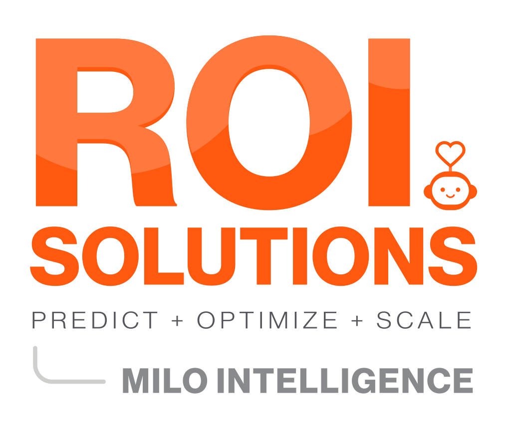
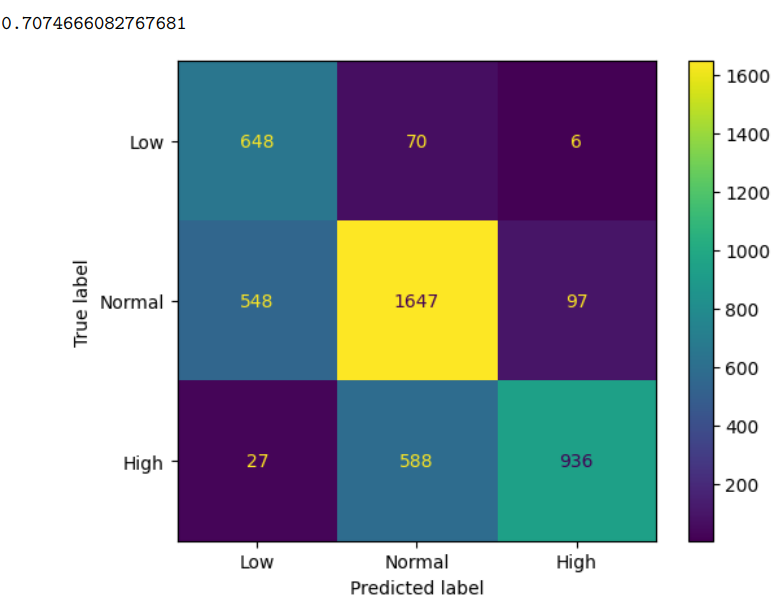
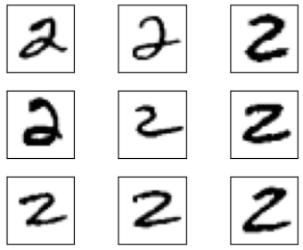
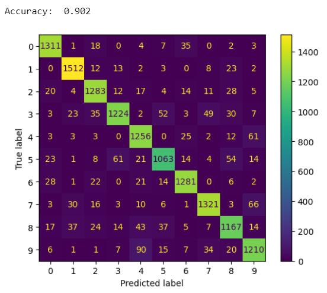
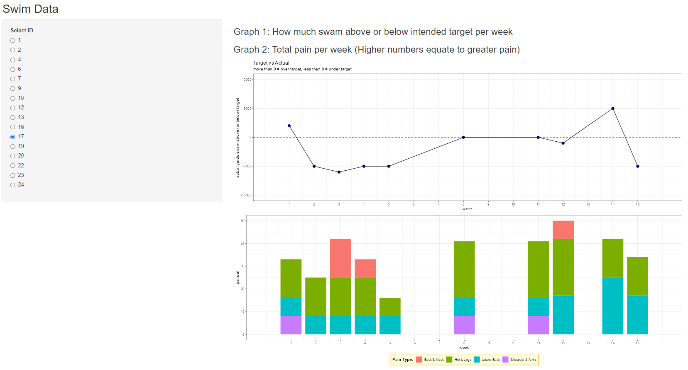

# Portfolio
---

## Education & Professional Experience
#### Education
<ul>
<li>B.S. in Data Science, Mathematics -  Merrimack College 
May 2024</li>
<li>M.S. in Computer Science -  Georgia Institute of Technology 
Specialization: Machine Learning 
December 2026 </li>
</ul>

#### Professional Experience
<ul>
<li>Machine Learning Intern - ROI Solutions</li>
<li>Research Assisstant - Merrimack College</li>
<li>Teaching Assistant - Merrimack College</li>
</ul>

#### [Resume](https://patrick-norcross-resume.tiiny.site/ "Resume")

---

## Projects

### Machine Learning Based Reinstatement Model for ROI Solutions

As the Machine Learning Intern, I was tasked with improving upon the reinstatement model for ROI Solutions' client 
Amnesty International. The reinstatement model pulls data from Amnesty's constituent database regarding last donation 
date, demographic data, donation amounts, total donations, and much more using a SQL script. The goal was to identify 
constiuents who had not donated in 24 months or longer and determine through machine learning models which constiuents 
were most likely to respond to Amnesty's upcoming mail campaign. Some of the major changes to this rebuild was updating 
the date range from 2018-2019 and bringing it up to date by including 2018-2022. I also added new features into the SQL 
script to add more information of each constiuent.
ROI Solutions utilizes DataRobot, a third-party service used for building a large variety of machine learning models
based on the file that is given. They rank the models based on a very large set of possible scoring techniques which
is then intepretted by the user to make a final decision on which model will perform best. To make sure this resulting
model was able to perform better I ran a test campaign which was withheld in the original training set. I ran these
scores through the current model in place as well as the rebuilt model. Looking at results yielded about a 10%
increase in the selection of constiuents who did respond to the mail campaign with a gift. Real World results of
this rebuild have not been determined yet as it will be used for Amnesty's November Campaign with results of the
campaign returned in Febuary of 2024.

I also spent time working with python, specifically a library called paramiko, which allows files to be directly pulled
from SFTP Servers into the script. I used this to create a script that the team could use on a monthly basis when producing
scores for various models and clients. It was able to pull the data that needed scoring from an SFTP
server, score the data in the script by using DataRobot's API, and then return the results back to the server,
as well as downloading the files needed locally for further analysis of the scores produced.

### Using Supervised Learning Techniques on Sleep Data
The American Time Use Survey (ATUS) measures the use of time spent doing various activites throughout a 24 hour period.
My goal in this project was to create categories of sleep levels "Low, normal, high" to then see if I can use 
the rest of the time use data to correctly categories these groups. I used 2018 data as a training set and used
the newest 2021 data as the test set going into the project in hopes of being able to use these models for future
years. Throughout the project I used various ensemble methods, tested with many different parameters to get optimal
scores. I also worked with Voting Classifiers which took into account Tree, kNN, SVM, and Naive Bayes models with 
optimized parameters using Grid Search.

Used accuracy score to refrence results as well as looking at confusion matrices to understand the results
visually and more in-depth.

[Link to the Code and Project](https://github.com/patrick-norcross/ATUS_supervised_learning)

### Classifying Written Digits using Neural Networks

Using a large database of hand written digits, I performed data manipulation to get these images into a dataframe
that identified each pixel on a scale of 0-255 based on its place in a scale from white to black. From there, I used
linear regression, multi-layer perceptrons, and neural networks to build models to predict these digits correctly. 

Accuracy was able to reach roughly 90% using the Multi-layer Perceptron Model. 

[Link to the Code and Project](https://github.com/patrick-norcross/Digit_Identification)

### Visualizations for Merrimack College's Swim Team
One of the research projects I had the oppurtunity to be a part of was working with the Swim and Diving team here 
at Merrimack College. This was something that was worked on slowly throughout the year. The swimmers were tasked 
with filling out a survey weekly. I took this data and had to perform heavy data cleaning and wrangling to be able
to perform any type of analysis. A large portion of the time has been devoted to creating visualizations for the 
swimmers to view after recieving data. This has been made easy by using R Shiny to be able to select the respective 
ID and their respective charts will then be brought up to view. There has been a dive into model building but hopes 
of more objective data in the future has largely held us off on that for now. Current work involves constant updates
to visuals, new visual ideas, and automating the process from data recieved to visuals produced.

[Link to the Code and Project](https://github.com/patrick-norcross/Swim_team_visuals)

---

## Connect

